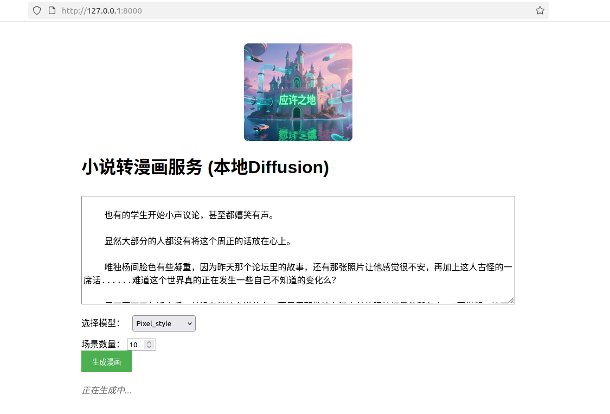

# 小说转漫画服务 (本地Diffusion版本)

这是一个基于本地部署的Stable Diffusion模型的小说转漫画服务，可以将小说文本转换为漫画风格的图片。
## 运行示例



## 精彩Demo
以下是功能演示视频（点击播放）：
<video src="https://henrypotter0546.github.io/Fantastic_Storyboard/screenshots/example_video.mp4" width="800" controls>
  你的浏览器不支持视频播放，请点击链接查看：[示例视频](https://henrypotter0546.github.io/Fantastic_Storyboard/screenshots/example_video.mp4)
</video>

## 功能特点

- 🎨 使用本地部署的Stable Diffusion模型生成图片
- 📖 支持中文小说文本输入
- 🖼️ 自动分割场景并生成对应的漫画图片
- 🌐 提供Web界面进行交互
- ⚡ 实时流式生成，支持边生成边显示

## 系统要求

- Python 3.8+
- CUDA支持的GPU（推荐，用于加速图片生成）
- 至少8GB内存（推荐16GB+）
- 至少10GB可用磁盘空间（用于存储模型）

## 安装步骤

1. 克隆项目
```bash
https://github.com/HenryPotter0546/cs_group_project.git
cd cs_group_project
```

2. 安装依赖
```bash
pip install -r requirements.txt
```

3. 配置环境变量
```bash
.env
# 编辑.env文件，填入你的DeepSeek API密钥
```

4. 启动服务
```bash
python main.py
```

服务将在 http://localhost:8000 启动

## 环境变量配置

在`.env`文件中配置以下变量：

- `DEEPSEEK_API_KEY`: DeepSeek API密钥（用于文本处理和翻译）


在`model.yaml`文件中配置好本地模型的路经，例如：
```bash
Unstable:
  path: "/home/henry/workspace/model_checkpoint/unstable_sdxl"
  single_files: false
  use_safetensors: false
  type: "sdxl"
```
## 使用方法

1. 打开浏览器访问 http://localhost:8000
2. 在文本框中输入小说内容
3. 设置要生成的场景数量（1-20）
4. 选择模型（最好选unstable）
5. 点击"生成漫画"按钮
6. 等待图片生成完成


## 生成视频
请提前在本地安装 ffmpeg

## 技术架构

- **后端**: FastAPI
- **AI模型**: Stable Diffusion (本地部署)
- **文本处理**: DeepSeek API
- **前端**: HTML + JavaScript (Server-Sent Events)

## 注意事项

- 首次运行时会下载Diffusion模型，可能需要较长时间
- 图片生成速度取决于GPU性能
- 建议使用CUDA支持的GPU以获得更好的性能
- 生成的图片为512x512像素

## 故障排除

1. **CUDA内存不足**: 减少batch_size或使用CPU模式
2. **模型下载失败**: 检查网络连接，或手动下载模型
3. **API调用失败**: 检查DeepSeek API密钥是否正确

## 贡献者

感谢Sheng Wang, Jingwei Zeng的贡献

## 许可证
MIT License

## 作者邮箱📫
henrypotterheng@gmail.com
